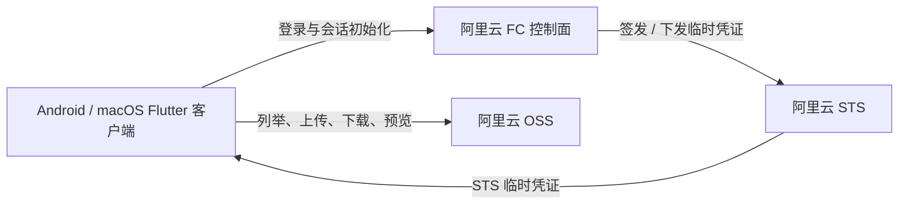

# 私域网盘（Private Domain Drive）

一个面向小范围固定成员的轻量共享文件应用，支持 Android 和 macOS。项目以阿里云 OSS 存储文件、阿里云 STS 提供临时访问凭证、阿里云函数计算（FC）承担轻量控制面，不引入常驻服务器或业务数据库。

## 项目定位

一期目标是在成本和维护复杂度可控的前提下，为家庭、朋友或小型固定协作群体提供共享文件空间。当前范围包括登录、目录浏览、上传下载、文件管理、图片预览、传输任务和 Android 系统分享导入；不定位为商业网盘，也不包含公开分享、复杂成员管理、在线协作编辑、视频转码或全文搜索等能力。

## 架构



客户端首次登录时通过 FC 获取会话、OSS 配置和 STS 凭证。后续凭证刷新优先使用本地安全存储的 `stsBroker` 直连阿里云 STS，文件流量始终直接访问 OSS，不经过 FC 中转。

## 仓库结构

本仓库维护项目级文档，并通过 Git Submodule 聚合两个独立子仓库：

| 路径 | 职责 | 说明 |
| --- | --- | --- |
| [`client/`](./client/) | Flutter 客户端 | Android / macOS 界面、会话、OSS 文件操作、传输与平台适配 |
| [`server/`](./server/) | FC 服务端 | 登录校验、STS 签发、配置与能力下发、健康检查 |
| [`docs/`](./docs/) | 项目文档 | 产品、功能、架构、接口与 Flutter 分层设计 |

客户端与服务端应分别在各自子仓库中提交；主仓库只在需要时提交文档和 submodule 引用版本。

## 快速开始

首次克隆时初始化子模块：

```bash
git clone --recurse-submodules git@github.com:littlefisher666/private-domain-drive.git
cd private-domain-drive
```

已有本仓库时执行：

```bash
git submodule update --init --recursive
```

本地运行和环境变量说明请分别查看：

- [客户端 README](./client/README.md)：Flutter 依赖、`env/local.json`、Android / macOS 启动、测试与发布。
- [服务端 README](./server/README.md)：STS / OSS 环境变量、本地 Node.js 调试、测试与 FC 部署。

客户端启动必须注入本地环境配置：

```bash
cd client
flutter run -d macos --dart-define-from-file=env/local.json
# 或
flutter run -d android --dart-define-from-file=env/local.json
```

`env/local.json` 以及任何真实 AccessKey、密钥和本地签名文件均不得提交到仓库。

## 文档导航

| 文档 | 内容 |
| --- | --- |
| [PRD](./docs/PRD.md) | 产品背景、目标、范围、场景与分期 |
| [用户故事](./docs/用户故事.md) | 角色、用户故事、异常路径与验收口径 |
| [功能需求](./docs/功能需求.md) | 功能定义、关键流程与平台体验 |
| [技术文档](./docs/技术文档.md) | 技术架构、传输、安全与 OSS / STS 设计 |
| [接口文档](./docs/接口.md) | FC 接口契约、会话和错误码 |
| [Flutter 架构设计](./docs/Flutter架构设计.md) | 客户端分层、目录与模块职责 |

## 贡献约定

- 产品、架构和跨仓库契约变化优先更新 `docs/`。
- Flutter 代码只放在 `client/`，FC 代码只放在 `server/`。
- 文件上传下载不经服务端中转；权限以阿里云 RAM / STS Policy 的最终鉴权结果为准。
- 提交前确认没有误提交构建产物、缓存、本地环境配置或密钥，并注意子模块引用是否需要同步更新。
