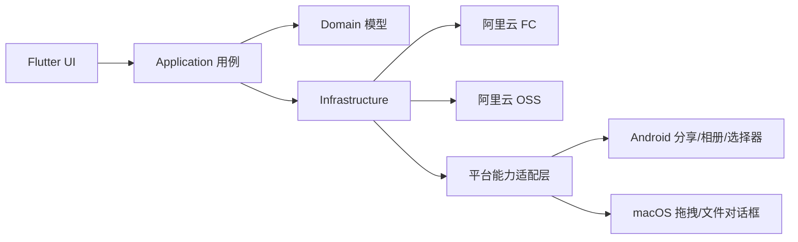
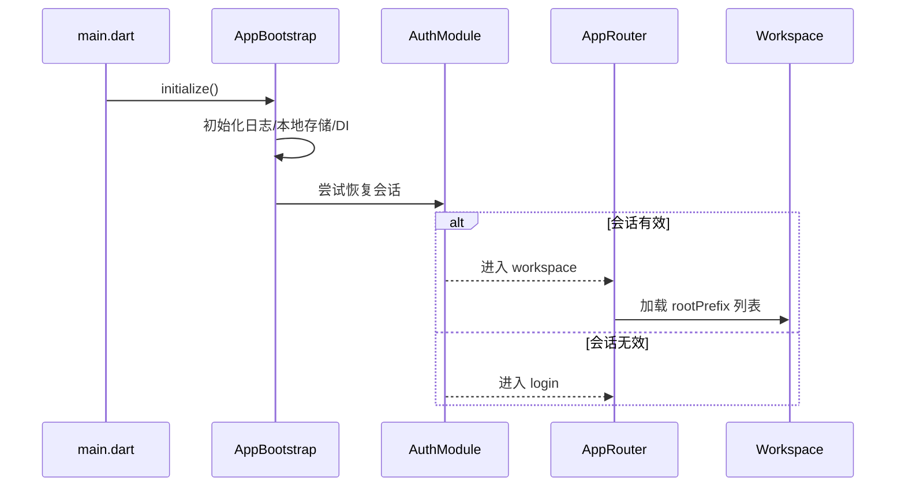

# Flutter 架构设计

## 1. 文档概述

- 项目名称：私域网盘（Private Domain Drive）
- 文档类型：Flutter 客户端架构与模块设计
- 文档版本：V1.0
- 文档日期：2026-08-10
- 目标平台：Android、macOS
- 实现仓库：`private-domain-drive-client/`
- 关联文档：
  - [PRD.md](./PRD.md)
  - [用户故事.md](./用户故事.md)
  - [功能需求.md](./功能需求.md)
  - [技术文档.md](./技术文档.md)
  - [ui/index.html](./ui/index.html)

### 1.1 文档目标

本文档在 [技术文档.md](./技术文档.md) 的总体方案之上，收敛 Flutter 客户端的：

- 分层架构
- 功能模块边界
- 目录结构
- 状态与依赖管理
- 平台差异适配
- 核心业务流程在客户端内的落地方式

目标是让 Android / macOS 共用一套业务核心，同时把平台差异控制在明确边界内。

### 1.2 设计原则

- **轻量优先**：一期不引入过重架构，不为“看起来完整”增加中间层。
- **业务复用，平台隔离**：登录、目录、传输、权限判断等核心逻辑双端共用；文件选择、拖拽、分享、保存路径等收敛到适配层。
- **云端鉴权兜底**：客户端只做能力展示与交互收敛，最终权限以 OSS / STS 为准。
- **文件流量不经业务后端**：上传下载预览直连 OSS；FC 只负责鉴权、STS 与配置下发。
- **按 feature 组织，按分层落地**：模块按业务能力拆分，模块内部统一 `presentation / application / domain / infrastructure`。
- **与现有骨架对齐**：优先在当前客户端工程骨架上迭代，不另起一套目录体系。

## 2. 架构定位

### 2.1 客户端在整体方案中的位置



客户端职责：

- 登录会话与 STS 凭证生命周期
- 目录浏览与基础文件操作
- 上传 / 下载任务编排
- 图片 / PDF / 文本预览
- 按能力信息渲染操作入口
- 错误反馈与会话恢复
- Android 系统分享导入
- Android / macOS 差异化交互

客户端不负责：

- 成员审批与复杂权限编排后台
- 文件流量中转
- 业务数据库
- 公开分享链接管理
- 视频转码、Office 在线编辑

### 2.2 总体分层

```text
presentation  -> 页面、组件、路由、用户交互状态
application   -> 用例编排（登录、列目录、上传、下载、删除）
domain        -> 实体、能力模型、任务状态、领域规则
infrastructure-> FC API、OSS SDK、本地存储、平台适配
```

OSS 平台差异收敛在本地 Flutter 插件 `packages/private_domain_oss/`：Dart facade 定义统一方法、模型、错误码和事件；Android Kotlin 使用 OSS Android SDK `2.9.21`；macOS Swift 使用 OSS SDK for Swift V2 `0.3.0`，最低支持 macOS 12.0。MethodChannel 仅传递配置、对象参数和本地路径，EventChannel 按 `taskId` 上报累计传输字节。

依赖方向固定为：

`presentation -> application -> domain`
`application / presentation -> infrastructure 抽象接口`
`infrastructure -> domain`

禁止：

- UI 直接调用 OSS / FC SDK
- domain 依赖 Flutter Widget 或平台 API
- infrastructure 反向依赖 presentation

## 3. 目录结构

与当前 `private-domain-drive-client/lib` 骨架保持一致，建议结构如下：

```text
lib/
  main.dart
  app/
    app.dart
    bootstrap/
      app_bootstrap.dart
    router/
      app_router.dart
      route_names.dart
    theme/
      app_theme.dart
  core/
    constants/
    errors/
    network/
    utils/
  features/
    auth/
      application/
      domain/
      infrastructure/
      presentation/
    workspace/
      application/
      domain/
      infrastructure/
      presentation/
    transfer/
      application/
      domain/
      infrastructure/
      presentation/
    preview/
      application/
      domain/
      infrastructure/
      presentation/
    share_import/          # Android 系统分享，可先挂在 transfer/workspace 下，后续独立
      application/
      domain/
      infrastructure/
      presentation/
    settings/
      application/
      domain/
      infrastructure/
      presentation/
  shared/
    models/
    providers/
    widgets/
  platform/                # 建议新增：平台差异适配
    file_picker/
    drag_drop/
    share_receiver/
    path_provider/
```

### 3.1 顶层目录职责

| 目录 | 职责 |
| --- | --- |
| `app/` | App 入口组装、主题、路由、启动初始化 |
| `core/` | 跨 feature 的基础能力：错误模型、常量、HTTP 封装、通用工具 |
| `features/` | 业务功能模块，每个模块自包含分层 |
| `shared/` | 跨模块复用的轻量组件、Provider、DTO/视图模型 |
| `platform/` | 平台能力抽象与实现（Android / macOS） |

### 3.2 feature 内部分层职责

| 层级 | 放什么 | 不放什么 |
| --- | --- | --- |
| `presentation` | Page、Widget、Controller/Notifier、表单与交互状态 | OSS/FC 细节、复杂业务规则 |
| `application` | UseCase / Service 编排，跨仓库流程 | Widget、平台 API |
| `domain` | 实体、枚举、能力模型、纯规则 | Flutter、网络库、SDK |
| `infrastructure` | Repository 实现、SDK 封装、DTO 映射 | 页面逻辑 |

## 4. 功能模块设计

### 4.1 模块总览

| 模块 | 对应需求 | 核心职责 | 一期优先级 |
| --- | --- | --- | --- |
| `auth` | US-01 / US-13 / 功能 2.1 | 登录、会话、STS 刷新、重新登录 | P0 |
| `workspace` | US-02 / US-03 / US-08 / US-09 / US-10 / US-16 / 功能 2.2、2.6 | 目录浏览、CRUD、列表/缩略图、能力驱动 UI | P0 |
| `transfer` | US-04 / US-05 / US-06 / US-12 / 功能 2.3、2.4、2.7 | 上传下载任务、进度、重试、取消 | P0/P1 |
| `preview` | US-07 / 功能 2.5 | 图片、PDF、文本预览 | P0 |
| `share_import` | US-11 / 功能 2.8 | Android 系统分享接收与确认上传 | P0 |
| `settings` | US-14 / US-15 | 账号信息、能力展示、关于/退出登录 | P1 |

说明：

- 权限展示不单独拆成大模块，作为 `auth` 下发能力 + `workspace/transfer/preview` 消费能力的横切规则。
- 上传入口可在 `workspace` 触发，真正的任务生命周期归属 `transfer`。

### 4.2 auth 模块

#### 职责

- 管理登录态与用户身份
- 调用 FC 换取 STS 临时凭证、OSS 配置、能力描述
- 处理凭证临期刷新与失效恢复
- 向其他模块提供只读会话上下文

#### 关键模型建议

```dart
class UserSession {
  final String userId;
  final String role; // admin | member
  final Capabilities capabilities;
  final OssConfig ossConfig;
  final StsCredentials credentials;
}

class Capabilities {
  final bool list;
  final bool download;
  final bool upload;
  final bool delete;
  final bool preview;
}

class StsCredentials {
  final String accessKeyId;
  final String accessKeySecret;
  final String securityToken;
  final DateTime expiration;
}
```

#### 用例

- `LoginUseCase`
- `BootstrapSessionUseCase`
- `RefreshCredentialsUseCase`
- `LogoutUseCase`

#### 约束

- 不持久化高权限永久密钥
- 首次登录由 FC bootstrap 下发 STS + stsBroker（最小化 AssumeRole 换票凭证）
- STS 与 stsBroker 保存在安全本地存储；STS 过期后优先客户端直连阿里云 AssumeRole 刷新，不经 FC
- 本地换票失败时再考虑 FC refresh 兜底；仍失败则统一导向重新登录
- 不在 UI 层直接拼装 STS 请求

### 4.3 workspace 模块

#### 职责

- 基于 OSS prefix 浏览目录
- 展示名称、类型、大小、更新时间
- 新建文件夹、重命名、删除
- 列表 / 缩略图切换
- 根据 `Capabilities` 控制操作入口

#### 关键模型建议

```dart
class FileItem {
  final String path;       // OSS object key / prefix
  final String name;
  final bool isDirectory;
  final int? size;
  final DateTime? updatedAt;
  final String? extension;
}

enum BrowseMode { list, grid }
```

#### 用例

- `LoadDirectoryUseCase`
- `CreateFolderUseCase`
- `RenameObjectUseCase`
- `DeleteObjectUseCase`
- `ResolveFileTypeUseCase`

#### 浏览规则

- 列表模式：信息密度优先，展示元信息
- 缩略图模式：仅图片尝试真实缩略图，其他类型用默认图标
- 缩略图失败必须降级，不影响布局
- 浏览方式偏好可会话保持；成本可控时本地持久化

#### 删除规则

- 必须二次确认
- 文案明确“一期无回收站”
- 文件操作能力默认全员开放；无对应能力时隐藏或禁用入口
- 一期不区分管理员与普通成员
- 即使 UI 误显示，OSS 拒绝后也要给出明确提示

### 4.4 transfer 模块

#### 职责

- 统一管理上传 / 下载任务
- 进度、成功、失败、取消状态
- 大文件分片上传
- 失败重试
- 为 workspace、share_import、preview 提供统一任务入口

#### 关键模型

与现有骨架对齐并扩展：

```dart
enum TransferTaskStatus { pending, running, success, failed, canceled }
enum TransferTaskType { upload, download }

class TransferTask {
  final String id;
  final String name;
  final TransferTaskType type;
  final TransferTaskStatus status;
  final double progress; // 0.0 ~ 1.0
  final String? remotePath;
  final String? localPath;
  final String? message;
  final DateTime createdAt;
  final DateTime? updatedAt;
}
```

#### 用例

- `EnqueueUploadUseCase`
- `EnqueueDownloadUseCase`
- `RetryTransferTaskUseCase`
- `CancelTransferTaskUseCase`
- `ObserveTransferTasksUseCase`
- `ConfigureTransferConcurrencyUseCase`

#### 上传策略

- 小文件直传
- 大文件分片上传
- 同名文件：覆盖前确认
- 成功后通知 workspace 刷新目标目录
- 文件选择使用 `withData: false`，任务只保存本地源路径、对象键和文件大小
- SDK字节回调达到总量后进入“正在确认”，最终成功以 OSS响应为准

#### 下载策略

- 文件可下载，文件夹一期不支持打包下载
- 支持默认目录或用户选择目录
- 成功后提供打开文件 / 打开目录入口（平台能力允许时）
- 多选下载一次选择目录，每个文件独立任务；队列总并发数为 1 至 5，默认 3
- 下载使用流式写入，避免批量下载时将完整文件保留在内存中
- 原生 SDK写入临时路径，成功后改名，失败或取消删除临时文件
- 上传下载速度由 Flutter 使用最近 2 秒字节窗口计算，并按 100ms 节流 UI
- 运行中取消通过平台桥接中止 SDK请求，退出登录同步清理原生凭证

### 4.5 preview 模块

#### 职责

- 判断文件是否可预览
- 图片 / PDF / 文本预览
- 不支持类型给出说明，并提供下载入口

#### 规则

- 图片：内存或临时文件加载
- PDF：下载后本地渲染
- 文本：UTF-8 优先，超大文本截断并提示
- Office / 视频等：明确“暂不支持预览”

#### 用例

- `ResolvePreviewTypeUseCase`
- `LoadPreviewContentUseCase`

### 4.6 share_import 模块（Android）

#### 职责

- 接收系统 `SEND` / `SEND_MULTIPLE`
- 展示待上传列表
- 选择目标文件夹
- 登录态恢复后不丢失待上传内容
- 确认后交给 `transfer` 创建上传任务

#### 关键流程

1. 系统拉起 App（冷/热启动）
2. 解析分享内容为本地待上传项
3. 若未登录或会话失效，先走 auth 恢复
4. 进入确认页：列表、目标目录、切换目录、确认/取消
5. 确认后创建上传任务

#### 约束

- 一期优先图片，普通文件尽量兼容同一流程
- 无上传权限时明确拒绝，不创建无效任务
- 确认前允许移除部分项

### 4.7 settings 模块

#### 职责

- 展示当前用户、角色、能力摘要
- 退出登录
- 基础关于信息 / 版本号
- 不提供复杂成员管理后台

## 5. 应用层与依赖管理

### 5.1 启动流程



### 5.2 依赖注入建议

一期建议使用轻量方案，优先：

- `Riverpod`（推荐）：适合会话、目录、任务流等可观察状态
- 或项目已存在的最小 Service Locator

原则：

- Repository / UseCase 通过 Provider 注入
- 不在 Widget 中 `new` 出 infrastructure 实现
- 平台实现按 `TargetPlatform` 或条件导入切换

### 5.3 状态边界

| 状态 | 归属 | 说明 |
| --- | --- | --- |
| 登录会话 / STS / 能力 | auth | 全局只读，供其他模块消费 |
| 当前目录、浏览方式、列表加载态 | workspace | 页面级 + 少量会话级偏好 |
| 传输任务列表 | transfer | 全局可观察 |
| 预览内容缓存 | preview | 页面级，退出可释放 |
| 分享待上传列表 | share_import | 流程级，恢复登录后仍需保留 |

不建议把所有状态塞进单一全局 Store。

## 6. 导航与信息架构

### 6.1 路由

当前骨架路由可继续沿用：

| 路由 | 页面 | 说明 |
| --- | --- | --- |
| `/splash` | SplashPage | 启动与会话恢复 |
| `/login` | LoginPage | 登录 |
| `/workspace` | WorkspacePage | 文件空间主页 |
| `/preview` | PreviewPage | 预览 |
| `/transfers` | TransferTasksPage | 传输中心 |
| `/settings` | SettingsPage | 我的/设置 |
| `/share-confirm` | ShareConfirmPage | Android 分享确认（建议新增） |

### 6.2 平台导航骨架

#### Android

- 底部主导航：文件 / 传输 / 我的
- 文件页：应用栏 + 列表/宫格 + FAB 上传
- 文件操作：点击进入、长按或更多菜单
- 不依赖 hover

#### macOS

- 宽屏双栏或三栏：侧栏导航 + 目录内容 + 可选详情
- 支持拖拽上传区
- 下载保存位置更贴近桌面习惯

信息结构两端保持一致，交互形态允许差异。

## 7. Infrastructure 设计

### 7.1 接口抽象建议

```dart
abstract class SessionRepository {
  Future<UserSession?> restore();
  Future<UserSession> login({required String account, required String password});
  Future<UserSession> refreshCredentials();
  Future<void> logout();
}

abstract class FileRepository {
  Future<List<FileItem>> listDirectory(String prefix);
  Future<void> createFolder(String path);
  Future<void> rename(String fromPath, String toPath);
  Future<void> delete(String path);
}

abstract class ObjectStorageClient {
  Future<ListObjectsResult> listObjects({required String prefix});
  Future<void> putObject({
    required String key,
    required Stream<List<int>> data,
    required int size,
    void Function(double progress)? onProgress,
  });
  Future<void> multipartUpload(/* 分片参数 */ );
  Future<void> getObject({
    required String key,
    required String savePath,
    void Function(double progress)? onProgress,
  });
  Future<void> deleteObject(String key);
  Future<Uri?> getPreviewUrl(String key);
}

abstract class PlatformFileGateway {
  Future<List<LocalFileRef>> pickFiles();
  Future<List<LocalFileRef>> pickImages(); // Android 相册
  Stream<List<LocalFileRef>> watchDroppedFiles(); // macOS
  Stream<SharePayload> watchShareIntents(); // Android
  Future<String> resolveDownloadPath({String? preferredName});
}
```

### 7.2 与云端交互边界

| 能力 | 调用方 | 目标 |
| --- | --- | --- |
| 登录 / 取 STS / 能力 / OSS 配置 | auth.infrastructure | FC |
| 列举、上传、下载、删除、重命名 | workspace/transfer.infrastructure | OSS |
| 文件选择、拖拽、分享、本地路径 | platform | OS |

### 7.3 错误模型

在现有 `AppError` 上扩展类型化错误，避免把阿里云原始术语直接抛给用户：

```dart
enum AppErrorType {
  network,
  unauthorized,
  credentialExpired,
  permissionDenied,
  storage,
  validation,
  unsupported,
  unknown,
}
```

处理原则：

- `credentialExpired`：优先自动刷新，失败再引导重新登录
- `permissionDenied`：明确“当前账号无权执行该操作”
- `network`：提供重试
- 日志可保留底层 code，UI 文案保持产品语言

## 8. 核心客户端流程

### 8.1 登录进入文件空间

1. 用户提交账号口令
2. `LoginUseCase` 调 FC 获取会话、STS、能力、OSS 配置
3. 写入会话仓库
4. 进入 workspace，按 `rootPrefix` 拉列表
5. 目标：登录成功后 3 秒内进入文件列表

### 8.2 目录浏览

1. 用户进入目录 / 下拉刷新
2. `LoadDirectoryUseCase` 调 OSS list
3. 将 common prefix 映射为文件夹，object 映射为文件
4. presentation 按 `BrowseMode` 渲染列表或缩略图

### 8.3 上传

1. workspace / share_import / 拖拽入口收集本地文件
2. 校验 `capabilities.upload`、目标路径、同名策略
3. `EnqueueUploadUseCase` 创建任务
4. transfer 执行直传或分片上传
5. 成功后刷新目标目录，任务状态更新为 success

### 8.4 下载

1. 用户在列表或预览页点击下载
2. 校验 `capabilities.download`
3. 创建下载任务并写本地路径
4. 完成后提示结果

### 8.5 会话失效恢复

1. 任意 OSS/FC 调用识别凭证失效
2. 尝试 `RefreshCredentialsUseCase`
3. 成功则重放原操作（可重试的读/写）
4. 失败则保留现场（尤其是分享待上传列表），引导重新登录

## 9. 平台适配策略

### 9.1 共用层

两端共用：

- domain 模型
- application 用例
- FC / OSS 访问编排
- 任务状态机
- 权限展示规则
- 主题 token 与基础组件

### 9.2 差异层

| 能力 | Android | macOS | 落地位置 |
| --- | --- | --- | --- |
| 文件选择 | 系统选择器 | 文件对话框 | `platform/file_picker` |
| 相册 | 支持 | 不强调 | `platform/file_picker` |
| 拖拽上传 | 不要求 | 支持 | `platform/drag_drop` |
| 系统分享 | 支持 SEND / SEND_MULTIPLE | 不涉及 | `platform/share_receiver` |
| 布局 | 单栏 + 底栏 + FAB | 双栏/三栏 | presentation 响应式/平台分支 |
| 文件操作手势 | 点击/长按/更多菜单 | 右键/工具栏可补充 | workspace presentation |
| 下载路径 | 应用目录或用户选择 | 更贴近访达保存习惯 | `platform/path_provider` |

### 9.3 UI 一致性要求

- Android 统一浅色/深色主题，避免页面风格跳变
- macOS 可更桌面化，但不另起业务逻辑
- 不要求像素级一致，要求信息结构与主流程一致

## 10. 安全与凭证设计（客户端视角）

- 仅持有 STS 临时凭证，不嵌入长期高权限密钥
- 凭证与能力信息来自 FC，不在本地伪造权限
- UI 显隐只是体验收敛，不是安全边界
- 本地如需缓存会话：
  - 可缓存 userId、role、capabilities、ossConfig、STS
  - 必须校验 expiration
  - 退出登录时清理
- 日志默认脱敏，不打印完整 secret / securityToken

## 11. 性能与体验约束

| 指标 | 要求 | 架构侧做法 |
| --- | --- | --- |
| 登录后进列表 | 尽量 3 秒内 | 启动并行初始化，会话恢复短路登录页 |
| 列表滚动 | 流畅 | 列表虚拟化、缩略图按需加载与缓存 |
| 传输反馈 | 及时 | 任务进度流式更新，不阻塞 UI isolate 过重计算 |
| 弱网 | 可恢复 | 分片上传、失败重试、明确错误态 |
| 内存 | 预览可控 | 大图/PDF/文本设置上限，用完释放 |

## 12. 推荐依赖方向（一期）

只列架构相关建议，具体版本以实施时为准：

- 状态管理：`flutter_riverpod`
- 路由：先维持现有 `onGenerateRoute`；复杂度上升后再评估 `go_router`
- 网络：`dio` 或等价 HTTP 客户端（FC 调用）
- OSS：官方/社区成熟 OSS SDK，或基于签名的轻量封装
- 本地安全存储：`flutter_secure_storage`（如需缓存 STS）
- 文件选择：`file_picker`
- 路径：`path_provider`
- 分享接收（Android）：`receive_sharing_intent` 或自研 Platform Channel
- 预览：图片用内置 Image；PDF/文本选双端可用插件

原则：能少则少，先打通闭环，再替换实现。

## 13. 开发落地顺序

### 第一批：骨架跑通

- App 启动、主题、路由
- auth 登录 / 会话恢复 / STS 获取
- workspace 列表与目录进出
- 基础错误提示

### 第二批：传输与预览

- 上传（含分片）
- 下载
- transfer 任务中心
- 图片 / PDF / 文本预览

### 第三批：权限与平台能力

- 能力驱动 UI
- 删除二次确认
- macOS 拖拽上传
- Android 相册与系统分享导入
- 列表 / 缩略图切换

### 第四批：体验稳定

- 凭证自动刷新与操作重放
- 前后台切换下的任务状态
- 缩略图缓存与失败降级
- 日志与基础可观测性

## 14. 与现有工程的映射

当前客户端骨架已具备：

- `app/` 启动、主题、路由
- `features/auth|workspace|transfer|preview|settings` 分层目录
- domain 基础模型：`UserSession`、`FileItem`、`TransferTask`
- application 用例雏形：`BootstrapSessionUseCase`、`LoadDirectoryUseCase`

后续实施时：

1. 先补齐 domain 模型字段（capabilities、STS、任务路径等）
2. 再补 infrastructure 的 FC / OSS 实现
3. 最后把 presentation 从占位页推进到可交互闭环
4. 平台差异优先进入 `platform/`，避免散落在页面里

## 15. 明确不做的架构事项（一期）

- 不引入完整 Clean Architecture 生成器或重型模块化框架
- 不自建客户端权限引擎去解析 RAM Policy
- 不把上传下载改成服务端中转
- 不建设复杂离线同步引擎
- 不在 App 内做成员角色矩阵后台
- 不为桌面和移动端维护两套业务仓库

## 16. 验收对照

| 架构能力 | 对应用户故事 / 功能 |
| --- | --- |
| 会话与 STS 生命周期 | US-01、US-13 / 功能 2.1 |
| 目录浏览与 CRUD | US-02、US-03、US-08、US-09、US-16 / 功能 2.2 |
| 上传下载与任务中心 | US-04、US-05、US-06、US-12 / 功能 2.3、2.4、2.7 |
| 预览 | US-07 / 功能 2.5 |
| 能力驱动 UI | US-10、US-15 / 功能 2.6 |
| Android 分享导入 | US-11 / 功能 2.8 |
| 双端体验差异隔离 | US-14 / 功能 2.9 |

## 17. 结论

Flutter 客户端采用“**按 feature 拆分 + 四层分层 + 平台适配边界**”的轻量架构：

- 业务核心双端共用
- 文件直连 OSS
- FC 只做鉴权与配置
- 权限云端兜底
- 平台差异集中治理

该架构与当前 `private-domain-drive-client` 骨架一致，可直接作为一期实现与代码评审依据。后续若模块增长，优先在现有 feature 内扩展，而不是重新定义分层体系。
