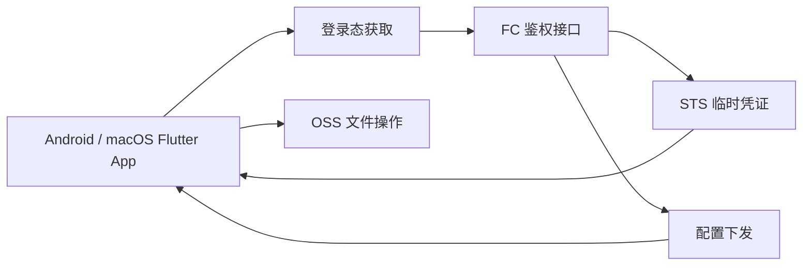
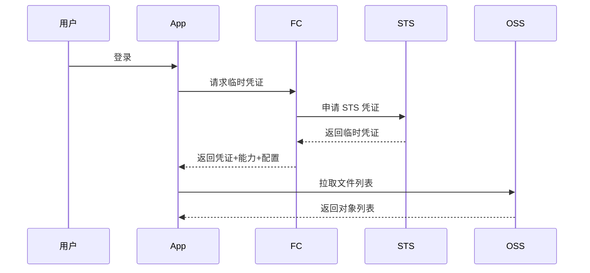

# 私域网盘技术文档

## 1. 文档概述

- 项目名称：私域网盘
- 文档类型：一期技术方案文档
- 依据文档：[PRD.md](/Users/littlefisher/Documents/LittleFisher/Workspaces/jyn/private-domain-drive/docs/PRD.md)
- 目标平台：Android、macOS
- 技术目标：在不引入传统重后端、数据库和复杂权限后台的前提下，落地一套基于阿里云 OSS 的轻量共享文件方案。

## 2. 设计目标

### 2.1 目标

- 支持 Android 与 macOS 共用同一套核心业务逻辑
- 通过轻量云端能力完成身份校验与临时凭证签发
- 支持文件浏览、上传、下载、删除和基础预览
- 权限以阿里云侧鉴权为准，客户端只负责能力呈现
- 控制固定成本与运维复杂度

### 2.2 非目标

- 不建设自有用户中心、数据库后台、审计中心
- 不做公开注册链接、在线协同编辑、复杂搜索
- 不做视频在线播放转码、Office 在线编辑
- 不做大规模用户、多租户能力

## 3. 总体架构

### 3.1 架构选型

- 客户端：Flutter
- 文件存储：阿里云 OSS
- 临时授权：阿里云 STS
- 轻后端：阿里云函数计算 FC
- 可选入口：阿里云 API 网关
- 轻量配置：函数环境变量或 OSS 中的 JSON 配置文件

### 3.2 架构原则

- 文件数据直接存储在 OSS，不经业务后端中转
- 业务后端只处理鉴权、凭证签发和少量配置下发
- 权限控制放在云侧，避免仅靠客户端 UI 限制
- 客户端尽量复用逻辑，平台差异集中在文件选择、存储、预览和拖拽能力

### 3.3 逻辑架构图



## 4. 模块划分

### 4.1 客户端模块

#### 4.1.1 认证模块

- 管理登录态
- 向轻后端换取 STS 临时凭证
- 处理凭证过期、刷新、重新登录

#### 4.1.2 文件浏览模块

- 按目录前缀列出文件与文件夹
- 展示文件名、大小、更新时间、类型
- 支持刷新、空态、错误态

#### 4.1.3 上传模块

- Android 调用系统文件选择器
- macOS 支持文件选择与拖拽上传
- 支持上传进度、失败重试、分片上传

#### 4.1.4 下载模块

- 发起下载任务
- 保存到本地目录
- 展示进度、状态与失败重试

#### 4.1.5 预览模块

- 图片预览
- PDF 预览
- 文本预览

#### 4.1.6 权限展示模块

- 根据服务端返回的能力信息控制按钮显隐
- 对关键操作做前置能力判断
- 最终结果仍以 OSS 鉴权结果为准

#### 4.1.7 任务与错误处理模块

- 统一管理上传下载任务状态
- 处理网络异常、凭证失效、权限不足等错误
- 给出明确提示与重试入口

### 4.2 云端模块

#### 4.2.1 鉴权与凭证签发函数

职责：

- 校验当前登录用户身份
- 映射用户角色与目录访问范围
- 调用 STS 生成临时访问凭证
- 返回基础能力描述与必要配置

#### 4.2.2 配置管理

职责：

- 管理 bucket、endpoint、根目录前缀
- 管理角色到能力的映射
- 管理客户端需要的预览白名单、上传限制等基础配置

#### 4.2.3 OSS 存储层

职责：

- 存储共享文件数据
- 基于 RAM Policy / STS Policy 执行真实访问控制
- 提供列举、上传、下载、删除能力

## 5. 目录与数据组织

### 5.1 OSS 目录建议

```text
shared/
  common/
  photos/
  docs/
  uploads/
```

如后续需要扩展个人空间，可增加：

```text
users/
  user-a/
  user-b/
```

### 5.2 对象元数据策略

一期不单独建设业务数据库，对象信息以 OSS 为主：

- 文件名：来自对象 key
- 文件大小：来自 OSS 元数据
- 更新时间：来自 OSS 返回字段
- 文件类型：基于扩展名和 MIME 推断

### 5.3 配置存储建议

优先级如下：

1. FC 环境变量：适合少量固定配置
2. OSS JSON 配置：适合需要集中维护的角色与能力配置

建议配置项：

- `bucket`
- `endpoint`
- `root_prefix`
- `role_capabilities`
- `preview_extensions`
- `upload_constraints`

## 6. 权限模型设计

### 6.1 角色定义

- 管理员
- 普通成员

### 6.2 能力定义

- `list`
- `download`
- `upload`
- `delete`
- `preview`

### 6.3 设计原则

- 客户端不保存长期高权限密钥
- 客户端不以本地角色判断作为唯一安全依据
- STS 凭证权限尽量最小化，并限制到指定 prefix
- 删除等高风险操作需同时满足 UI 能力开放和云端真实授权

### 6.4 建议返回的能力结构

```json
{
  "userId": "user-a",
  "role": "member",
  "rootPrefix": "shared/",
  "capabilities": {
    "list": true,
    "download": true,
    "upload": true,
    "delete": false,
    "preview": true
  }
}
```

## 7. 接口设计

### 7.1 获取临时凭证接口

#### 接口职责

- 基于当前登录态返回 STS 临时凭证
- 返回当前用户角色、根目录范围与能力描述

#### 请求示例

```json
{
  "platform": "macos",
  "appVersion": "1.0.0"
}
```

#### 响应示例

```json
{
  "credentials": {
    "accessKeyId": "STS.xxx",
    "accessKeySecret": "xxx",
    "securityToken": "xxx",
    "expiration": "2026-06-05T12:00:00Z"
  },
  "oss": {
    "bucket": "private-domain-drive",
    "endpoint": "oss-cn-hangzhou.aliyuncs.com",
    "region": "cn-hangzhou",
    "rootPrefix": "shared/"
  },
  "user": {
    "userId": "user-a",
    "role": "member"
  },
  "capabilities": {
    "list": true,
    "download": true,
    "upload": true,
    "delete": false,
    "preview": true
  }
}
```

### 7.2 客户端与 OSS 的交互方式

- 文件列表：客户端基于 STS 凭证调用 OSS 列举接口
- 文件上传：客户端直传 OSS，小文件直传，大文件走分片上传
- 文件下载：客户端直连 OSS 下载
- 文件删除：客户端直接发起删除请求，由 OSS 鉴权拦截越权访问

### 7.3 是否引入 API 网关

建议：

- 若仅有少量鉴权接口，可先使用 FC HTTP 触发器
- 若后续需要统一域名、鉴权策略、限流和日志，可再接入 API 网关

## 8. 核心流程设计

### 8.1 登录与进入文件空间



### 8.2 上传流程

1. 用户选择文件或拖拽文件进入窗口。
2. 客户端校验当前目录、文件大小和上传能力。
3. 小文件走普通上传，大文件走分片上传。
4. 上传过程中展示进度、速度和结果状态。
5. 上传成功后刷新当前目录。
6. 上传失败时保留失败态并允许重试。

### 8.3 下载流程

1. 用户点击下载。
2. 客户端校验下载能力并创建本地任务。
3. 使用 STS 凭证从 OSS 下载对象。
4. 下载完成后写入本地目录并提示结果。

### 8.4 删除流程

1. 用户点击删除。
2. 客户端弹出二次确认。
3. 客户端向 OSS 发起删除请求。
4. OSS 根据临时凭证真实鉴权。
5. 成功则刷新列表，失败则提示权限不足或操作失败。

## 9. 客户端实现建议

### 9.1 代码分层

建议采用以下分层：

- `presentation`：页面、组件、状态展示
- `application`：用例编排，如登录、列文件、上传、下载
- `domain`：文件实体、能力模型、任务状态模型
- `infrastructure`：OSS SDK、FC API、平台文件系统适配

该分层重点是隔离平台能力与业务逻辑，便于 Android、macOS 共用主体代码。

### 9.2 状态管理建议

可选择 Flutter 常见轻量方案实现，例如：

- `Riverpod`
- `Bloc`
- 项目已存在方案

原则：

- 不为一期引入过重架构
- 凭证状态、当前目录、任务列表、错误提示需要可观察

### 9.3 平台差异点

Android：

- 使用系统文件选择器
- 适配移动端单栏结构
- 关注前后台切换后的任务状态恢复

macOS：

- 支持拖拽上传
- 可使用双栏或三栏布局
- 下载保存位置与本地文件访问体验需更贴近桌面习惯

## 10. 上传下载设计

### 10.1 上传策略

- 小文件：直接上传
- 大文件：分片上传
- 上传中断：允许重试
- 同名文件：一期建议先采用覆盖前确认策略

### 10.2 下载策略

- 下载到默认目录或用户选择目录
- 允许重复下载
- 下载完成后提供打开文件或打开目录入口

### 10.3 任务状态模型

建议统一抽象以下状态：

- `pending`
- `running`
- `success`
- `failed`
- `canceled`

## 11. 预览设计

### 11.1 支持范围

- 图片
- PDF
- 文本

### 11.2 实现建议

- 图片：直接获取对象并本地或内存加载
- PDF：下载后本地渲染或组件渲染
- 文本：下载后按 UTF-8 优先解析并展示基础内容

### 11.3 限制说明

- 大文件文本预览需设置大小上限
- 二进制文件不做预览兜底解析
- Office、视频等类型仅提示暂不支持

## 12. 错误处理与可观测性

### 12.1 错误分类

- 网络错误
- 凭证过期
- 权限不足
- OSS 操作失败
- 本地文件系统异常

### 12.2 处理原则

- 错误信息面向普通成员表达清晰，不暴露云厂商复杂术语
- 对可恢复错误提供重试入口
- 凭证过期优先自动刷新，失败后再提示重新登录

### 12.3 基础日志建议

一期不建设完整日志系统，但建议保留：

- 登录与凭证获取结果
- 文件列表加载耗时
- 上传下载任务成功率
- 常见错误码统计

## 13. 安全设计

### 13.1 凭证安全

- 仅使用 STS 临时凭证
- 有效期控制在合理范围内
- 到期前可提前刷新
- 不在客户端明文持久化长期密钥

### 13.2 权限安全

- STS policy 限制到指定 bucket 和 prefix
- 删除能力仅对授权角色开放
- 客户端误显示按钮时，云端仍需拒绝越权请求

### 13.3 数据安全

- 建议开启 OSS 服务端加密能力
- 如有需要可开启 HTTPS 强制访问
- 重要目录命名应稳定，避免权限前缀混乱

## 14. 性能与成本

### 14.1 性能目标

- 登录后 3 秒内完成凭证获取并进入文件列表页
- 常规目录浏览流畅
- 上传下载过程状态反馈及时

### 14.2 成本控制策略

- 不使用传统 ECS 常驻实例
- 不引入数据库
- 文件流量走 OSS 直传直下，减少函数中转成本
- 函数只保留轻量鉴权和配置能力

## 15. 开发拆分建议

### 15.1 第一批

- Flutter 工程初始化
- 登录态接入
- FC 获取 STS 凭证接口
- OSS 文件列表能力

### 15.2 第二批

- 上传与分片上传
- 下载与本地保存
- 图片/PDF/文本预览

### 15.3 第三批

- 权限驱动 UI
- 错误提示与重试
- macOS 拖拽上传
- 稳定性优化

## 16. 开发前待确认项

- 登录方式最终选型
- STS policy 的最小授权范围
- 是否第一期开放删除给普通成员
- 大文件分片阈值
- 预览支持的文件大小与格式范围
- Flutter 插件在 Android、macOS 的兼容性

## 17. 结论

一期建议采用“Flutter + OSS + STS + FC”的轻量技术方案。该方案能够满足 5 人以内、50GB 量级的小范围共享场景，并在成本、复杂度和可维护性之间取得较好的平衡。

技术实现上应始终坚持以下边界：

- 文件数据直连 OSS
- 后端只做轻量鉴权与配置下发
- 权限由云端兜底
- 客户端聚焦浏览、传输、预览和基础交互体验
